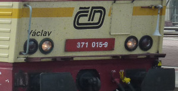

.. uic documentation master file, created by
   sphinx-quickstart on Mon Jun  9 23:00:14 2014.
   You can adapt this file completely to your liking, but it should at least
   contain the root `toctree` directive.

uic
###

.. toctree::
   :maxdepth: 2

.. automodule:: uic

Functions
=========

.. autofunction:: wagonnumbers
.. autofunction:: check_wagonnumber
.. autofunction:: cdigit
.. autofunction:: create_wagonnumber
.. autofunction:: parse_short_wagonnumber
.. autofunction:: parse_wagonnumber
.. autofunction:: parse_wagonnumber_pattern
.. autofunction:: digitsum
.. autofunction:: total_digitsum
.. autofunction:: diff10
.. autofunction:: multiply21

Indices and tables
==================

* :ref:`genindex`
* :ref:`modindex`
* :ref:`search`
